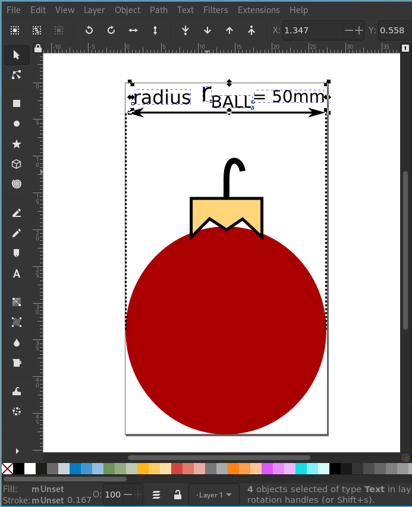

# Beautiful Figures for Scientific Writing featuring Inkscape and LaTeX

Beautiful, clean and precise figures are of importance in almost any field.
They might be used to simplify complex concepts, underline the written text or add additional information in form of graphs and plots.
In any case, it is important they are consistent in style, appealing to the user and easy to adapt and reuse.

### SVG is Superior

The first key point in creating beautiful figures, is to use scalable vector graphics over bitmaps wherever possible.
<div class="blog_box">
    Scalable Vector Graphic ≫ Bitmap
</div>

Whereas bitmaps contain information about pixel weights for a fixed size, vector graphics are a collection of textual instructions and formulas to draw the image.
Resizing a bitmap may come with problems due to the fixed size of pixels.
Making it smaller might break sharp edges but won't matter too much.
Trying to enlarge it exceeding its original size makes the picture blurry, as the new pixels have to be filled up based on a *guess* (I won't elaborate on the exact techniques).
One solution is to save your bitmap in a high quality, where the drawback comes with a large file size which one would not want to have on your web page.
It may also exceed the limits of the publishers requirements, or he decides to scale it down anyway leading to the very same problem.


As a vector graphic is a collection of instructions and formulas, it can be scaled arbitrary and won't lose any information and quality.
The file size is typically a fraction of a bitmap and therefore the preferred source for web pages, PDFs and other digital formats where the user might zoom in as much as he or she wants.

This doesn't really matter on a printed format, as the only way for the user to zoom in, would be to lower the distance between its retina and the printed paper not affecting the size dynamically.

### Inkscape for SVG Editing

[Inkscape](https://inkscape.org/) is a free and [open-source](https://gitlab.com/inkscape/inkscape) vector graphics editor for all major platforms, which has been around for roughly 20 years.
It has a steep learning curve, but I highly recommend investing the time to learn it.
The skill to efficiently use inkscape is something that will stay with you for the rest of your life and may be useful in many situations.
A great resource is the official documentation which can be found [here](https://inkscape-manuals.readthedocs.io/en/latest/index.html).

If you are like me, and mostly create and use figures in the context of a thesis, paper or other formats where the outcome is a PDF, then you probably already have a brief understanding of how large in size your figure will be.
<div class="blog_box">
    Choose a size that fits your output
</div>

Even though vector graphics are independent of scaling, adding text and choosing the thickness of borders is much easier if you already know the size of your output.

Sticking to a consistent style within a document, but also throughout multiple documents is fairly important and increases the quality a lot.
<div class="blog_box">
    Develop a consistent style
</div>

One feature I like, is to create your custom color palette, which can be selected on the arrow at the bottom right.
I got fairly used to the *Inkscape default*, so I used it as basis to then add colors myself to the top.

```sh
cp /usr/share/inkscape/palettes/inkscape.gpl ~/.config/inkscape/palettes/my_palette.gpl
$EDITOR ~/.config/inkscape/palettes/my_palette.gpl
```

Another best practice is to identify components of your figures that you might want to reuse.

<div class="blog_box">
    Isolate and reuse components
</div>

E.g. you have drawn a coordinate frame in one of your figures?
Great!
Now isolate it by putting it in a new document, group it with `Ctrl + g`, crop it with `Ctrl + Shift + r` and save it as individual figure in a destination where you store all the isolated objects.
The location I store it in is also a git repository, so I never lose track of it and can share it with my co-workers.
Once I want to reuse a coordinate frame, I just press `Ctrl + i` (Import...) and select the object.
This way I save a lot of time not redrawing it over and over again **and** develop a consistent style throughout the years.

### Inkscape + LaTeX - A Perfect Symbiosis

We now have reached the more technical and detailed part of this blog entry, discovering the symbiosis and beautiful integration between inkscape and latex. In short, a latex document is written in a textual form, of which the latex compiler will generate a PDF. Easy. We will assume you are familiar with latex and may have already used it for a thesis or paper. So let's dig into that.

Did you ever encounter the problem of embedding mathematical symbols such as $\pi$, $\phi$, or $\sqrt{\theta}$ in your figures?
Have you realized that the text is neither selectable, nor searchable in your PDF?
And with a closer look, you might also realize that the font doesn't *exactly* matches the font of your document?


When saving a PDF with inkscape, it offers you to *Embed fonts*, *Convert text to paths* or *Omit text in PDF and create LaTeX file*.
The latter option will create a `pdf` alongside a `pdf_tex` file, which solves all the errors above and opens the field for even more black magic.

<div class="blog_box">
    Use the <code>pdf_tex</code> format to embed it in latex
</div>

Let's start with a simple example by using some anti-patterns.
Assume, you already design your figure using inkscape, but for now you follow the principle of [WYSIWYG](https://en.wikipedia.org/wiki/WYSIWYG) - *What you see is what you get*. Thus, you change the position and size of the object and text until it looks good in inkscape and you are satisfied.




#### Exporting a PNG - The naive method

Now that you are happy with your drawing, you export it as `png`, and use `\includegraphics` to import it in your latex document:

```latex
\begin{figure}[htb]
    \centering
    \includegraphics[width=0.4\linewidth]{img_example.png}
    \caption{A red Christmas ball with a radius of $r_{\text{BALL}} = \SI{50}{\milli\meter}$.}%
\end{figure}
```

On the first sight it looks okay, but actually there are some issues. The rasterization (`png`) results in a low quality when zoomed in, and the text is non-selectable where a different font in type, weight and size is used. Looking at the caption, the symbol $r_{\text{BALL}}$ for the radius looks quite different as well. All in all, an inconsistent and unsatisfying result. 

<div class="image-flex">
    <div class="image-caption">
        
        <span>Rasterized image</span>
    </div>
    <div class="image-caption">
        
        <span>Non-selectable text</span>
    </div>
</div>

#### PDF -> Text to path - No more rasterization!

Congratulations, you are now using `pdf` which supports vector graphics. Therefore, the figure including its text won't lose quality when zooming in!
However, as we can see in the second image, the font isn't even selectable yet.

<div class="image-flex">
    <div class="image-caption">
        
        <span>No loss of quality</span>
    </div>
    <div class="image-caption">
        
        <span>Non-selectable text</span>
    </div>
</div>

#### PDF -> Embedding fonts - Selectable text!

By *embedding fonts*, the issue of it being non-selectable is now solved, but the font is still different from that used within the document, the weight and size is inconsistent and the symbol for the radius is yet not rendered well.


<div class="image-flex">
    <div class="image-caption">
        
        <span>No loss of quality</span>
    </div>
    <div class="image-caption">
        
        <span>Selectable text</span>
    </div>
</div>

#### PDF -> Omit text in PDF and create LaTeX file - Problems solved!

As you are working with a latex file, using this option is obviously superior to the others. But in what sense *exactly?*
To explain this, we need to understand why the font was always different in the first place.
You have used Inkscape for the self-contained figure and latex to then embed it in your document.
As two programs are involved and the figure is self-contained, the rendering and placement of the font must be accomplished by Inkscape following the earlier mentioned [WYSIWYG](https://en.wikipedia.org/wiki/WYSIWYG) concept.
If we want the font of a figure to match that of the document, we need to accomplish that latex itself renders the font of the figure (side note: With [PGF / Tikz](https://en.wikipedia.org/wiki/PGF/TikZ)
you could avoid using Inkscape at all and create the figure within latex by a text-based description).
This is exactly what will happen, when we check the box to *Omit text in PDF and create LaTeX file*.
Inkscape will create a `pdf_tex` file containing font and meta-data information as well as a `pdf` file which contains all the information about the figures.
Having two files means that the figure is now no longer self-contained and might only be used within a latex environment.

Now that latex will do the rendering, it will also render commands such as `\emph{}` or recognizes the math mode `$\pi$`.
Therefore, we can now type the symbol of the balls radius exactly as it is in the text (caption): `$r_{\text{BALL}} = \SI{50}{\milli\meter}$`.
Within Inkscape it will look like that:


Yes, I have to admit that editing the `svg` is quite inconvenient now, as we *do **not** see what we get* anymore.
Note, that the placement of the text entry within latex will be on the left center of the field and only the beginning of the text has to be within the drawing.
You can change the size and aspect ratio of it without affecting the rendered output.
Depending on the amount of commands involved in the text, things can become very messy, so I suggest decreasing to a size where everything can still be read.

To import a `pdf_tex` file in a figure, one might use the following snippet which includes tweaks to change the `fontsize` and `width` of the figure:

```latex
\usepackage{import}  % necessary package when importing from a different location

\begin{figure}[htb]
    \centering
    \fontsize{8pt}{10pt}\selectfont  % optional fine adjustment for fonts
    \def\svgwidth{0.4\linewidth}     % optional fine adjustment for svg width
    \import{images/}{img_example.pdf_tex}
    \caption{A red Christmas ball with a radius of $r_{\text{BALL}} = \SI{50}{\milli\meter}$.}%
\end{figure}
```

When we look at the results, the image is not rasterized, we have the very same font, it is selectable and even used the same symbols that we use in the text. Simply beautiful and everything we asked for.

<div class="image-flex">
    <div class="image-caption">
        
        <span>Correct symbols</span>
    </div>
    <div class="image-caption">
        
        <span>Selectable text</span>
    </div>
</div>

Taking things to another level, I introduce you to some black magic:
As LaTex will do the rendering for you, it is capable of interpreting any commands within the document's environment.
We can embrace that, by following [latex best practices](https://www.gleave.me/post/latex-design-patterns/) in terms of a typical [design pattern](https://en.wikipedia.org/wiki/Software_design_pattern) in software engineering: [Don't repeat yourself](https://en.wikipedia.org/wiki/Don%27t_repeat_yourself)
(DRY).
The part where we *do* repeat ourselves, is in the symbol of the Christmas ball's radius that we set to `r_{\text{BALL}}`.
If you are working on a bigger work such as a paper or thesis, I highly recommend to use custom commands for almost all symbols.
In our case I would define `\newcommand{\RadiusChristmas}{r_{\text{BALL}}}` to wrap the semantic meaning.

<div class="blog_box">
    Use custom commands for repetitive actions and symbols
</div>

This will make our work more readable, consistent (catches typos) and the most important: adaptable.
If you decide to use a different symbol such as $r_B$ instead of $r_{\text{BALL}}$, then you don't have to deal with any search and replace, as there is only a single place you have to change it.
Oh yes, you guessed it right: Using your custom commands in your figure will also magically change the occurrences of `\RadiusChristmas` without the need to manually change the figure yourself.


Once you got used to these handy features, there is no way for you ever going back to static raster images.

#### Final comparison for exports of Inkscape


| Method                          | Export PNG | Text to Path | Embedding Fonts | Omit text in PDF + LaTeX file |
|---------------------------------|:----------:|:------------:|:---------------:|:-----------------------------:|
| File type                       |    PNG     |     PDF      |       PDF       |         PDF + PDF_TEX         |
| Quality preserved               |  &#x274c;  |   &#x2714;   |    &#x2714;     |           &#x2714;            |
| Selectable text                 |  &#x274c;  |   &#x274c;   |    &#x2714;     |           &#x2714;            |
| Searchable Text                 |  &#x274c;  |   &#x274c;   |    &#x2714;     |           &#x2714;            |
| Same font as document*          |  &#x274c;  |   &#x274c;   |    &#x274c;     |           &#x2714;            |
| Consistent font size            |  &#x274c;  |   &#x274c;   |    &#x274c;     |           &#x2714;            |
| LaTeX commands                  |  &#x274c;  |   &#x274c;   |    &#x274c;     |           &#x2714;            |

\* In theory, the same font could always be achieved, if one configures Inkscape to use the latex font.
However, only for `pdf_tex` the font will change automatically depending on the document's font.

### What about Git?

Following the method above, we now have three different file types: editing an `svg` (the source), which outputs a `pdf_tex` containing text and meta information that loads the `pdf`.
The `svg` we need as source to edit in Inkscape for future changes and adoptions.
The `pdf_tex` and `pdf` we need to build (compile) our latex file.
Assuming you are a brave developer and make usage of git, you may ask yourself which one of these files should we now keep in our repository?

Credits of this part belong to my colleague [Freek](https://scholar.google.com/citations?user=aHPX6PsAAAAJ&hl=en&oi=ao). What you have to do is to think of it as source and binary files just like your C or C++ projects.

<div class="blog_box">
    Git flow: Only keep source files <code>svg</code> in VC
</div>

Committing your `build/` files is awkward and shouldn't be done.
The same must go for the output of your images, which is `pdf` and `pdf_tex`.
Only keep the `svg` source in your version control, as these are the files you edit and can convert in other file types (but not the other way around).

<div class="blog_box">
    Use a <code>makefile</code> to automatically create the <code>pdf_tex</code>
</div>

Taking things a step further, we might also use a similar technique that is applied to automatically build your C files into a binary.
Using a `makefile` to do the conversion, so you don't have to bother doing it manually yourself!
Note, that `Inkscape --version` has to be at least `1.0` or higher.

```makefile
BIN_DIR := ../images-bin
PDF_CMD := inkscape -D --export-latex

# collect all svgs
SVG_SOURCE := $(wildcard *.svg)
# change all .svg endings to -svg.pdf
TARGETS := $(subst .svg,-svg.pdf,$(SVG_SOURCE))
# prefix all targets with bin_dir
TARGETS := $(addprefix $(BIN_DIR)/,$(TARGETS))

all: $(BIN_DIR) $(TARGETS)

# for bin_dir, make directory
$(BIN_DIR):
	mkdir $(BIN_DIR)

# for each pdf target (and corresponding svg source), convert
$(BIN_DIR)/%-svg.pdf : %.svg
	@echo "$< -> $@"
	@$(PDF_CMD) --export-filename=$@ --file=$< 2> /dev/null

TARGETS_CLEAN := $(addsuffix *,$(TARGETS))
.PHONY: clean
clean:
	rm $(TARGETS_CLEAN)

```

The presented `makefile` should be put in an `images-src` folder and does the following things:
1. creates a binary folder (`../images-bin`) if not present
2. detects all source files (`wildcard *.svg`, `wildcard *png`, ...)
3. converts the `svg`s to `pdf` + `pdf_tex` by using Inkscape from the commandline

It allows us to not bother of anything but the source files while we are still able to convert them to `pdf_tex` automatically.
